```mermaid
graph TB
    subgraph Framework["🏗️ FRAMEWORK LAYER"]
        App["createApp()<br/>━━━━━━━━━━<br/>Manages Modules:<br/>• VISIBILITY_MODULE<br/>• WIZARD_MODULE<br/>• SCROLL_MODULE"]
        App -->|uses| SM1["core.createStateManager()<br/>📦 Core Building Block"]
    end

    style Framework fill:#e3f2fd,stroke:#1976d2,stroke-width:2px
    style App fill:#fff,stroke:#1976d2,stroke-width:2px
    style SM1 fill:#fff3e0,stroke:#f57c00,stroke-width:2px
```

```mermaid
graph TB
    subgraph Module["⚙️ MODULE LAYER"]
        MI["createModuleInstance()<br/>VISIBILITY_MODULE<br/>━━━━━━━━━━<br/>Manages Models:<br/>• modal-1<br/>• modal-2<br/>• dropdown-1"]
        MI -->|uses| SM2["core.createStateManager()<br/>📦 State + Logic"]
        MI -->|uses| OB["core.createObserver()<br/>📡 Events + Scope"]
    end

    Framework["Framework Layer:<br/>createApp()<br/>modules: Map"] -.->|stores| Module

    style Module fill:#f3e5f5,stroke:#7b1fa2,stroke-width:2px
    style MI fill:#fff,stroke:#7b1fa2,stroke-width:2px
    style SM2 fill:#fff3e0,stroke:#f57c00,stroke-width:2px
    style OB fill:#fff3e0,stroke:#f57c00,stroke-width:2px
    style Framework fill:#e8f5e9,stroke:#388e3c,stroke-width:2px,stroke-dasharray: 5 5
```

# Building a Modular State Framework from Scratch

## Introduction

This is a framework-agnostic system that provides building blocks for creating isolated, stateful components without coupling to any specific state management library (Redux, Zustand, MobX, etc.). It's a template framework that lets you quickly build self-contained UI services—modals, wizards, scroll managers, and more—with consistent patterns and zero external dependencies.

**What I built:**

A modular state framework with two distinct layers:

1. **Core primitives** — State manager and observer pattern implementation (zero dependencies except for a custom scoped observer)
2. **Framework layer** — Module/Model architecture that acts as a template for creating different services

**Key features:**

- **Framework-agnostic core** — The state management logic is completely decoupled from React. It can work with Vue, Svelte, or vanilla JavaScript
- **High separation of concerns** — Clear boundaries between state, mutations, getters, and actions with full encapsulation
- **Dependency-free** — No external state libraries. Only dependency is a custom scoped observer I built for event management
- **Reusable template pattern** — The same architecture powers visibility state (modals/dropdowns), wizard flows, and scroll management
- **Type-safe** — Fully generic TypeScript APIs that maintain type safety across the entire stack

---

## Part 1: Core Primitives

The core layer provides two fundamental building blocks that form the foundation of the entire framework. These primitives are intentionally simple, focused, and have zero knowledge of modules, models.

### The Core Interface

```typescript
// core/core.ts
const core = (() => {
  return {
    createStateManager,
    createObserver,
  };
})();
```

The core exposes exactly two functions, each solving a specific problem:

### 1. **createStateManager** — State Management Primitive

The state manager implements a clean separation between state, mutations (state updates), and getters (derived/computed values).

```typescript
function createStateManager<S, M, G>(props: {
  id: string;
  state: S;
  mutations(state: S): M;
  getters(state: S): G;
}) {
  return {
    state: props.state,
    mutations: props.mutations(props.state),
    getters: props.getters(props.state),
  };
}
```

**Key design decisions:**

- **Generic types** — `<S, M, G>` allow full type inference. Define your state shape once, and TypeScript knows everything
- **Mutations pattern** — All state changes go through mutations. No direct state modification
- **Getters pattern** — Computed values and state access through getters, keeping logic centralized
- **Closure-based** — State is enclosed in scope, mutations and getters have direct reference to it

**Why this pattern?**

This is similar to Vuex/Pinia patterns but simpler. By separating concerns, we get:

- Predictable state updates (only through mutations)
- Easy debugging (all changes traced to specific mutations)
- Type safety at every layer

### 2. **createObserver** — Event System Primitive

The observer implements a publish-subscribe pattern for communication between different parts of the system.

```typescript
function createObserver(scope: string) {
  const observer = createScopedObserver([{ scope }]);

  const dispatch = (eventName: string, payload?: any) => {
    observer.dispatch({ scope, eventName, payload: payload || undefined });
  };

  const subscribe = (eventName: string, callback: (payload: any) => void) => {
    return observer.subscribe({ scope, eventName, callback });
  };

  return { scope, dispatch, subscribe };
}
```

**Key design decisions:**

- **Scoped events** — Events are isolated by scope, preventing cross-contamination
- **Simple API** — Just `dispatch` and `subscribe`, nothing more
- **Cleanup support** — Subscribe returns an unsubscribe function for proper lifecycle management
- **Custom implementation** — Uses a custom scoped observer I built, not EventEmitter or other libraries

**Why separate observer from state?**

State management and event communication are different concerns:

- **State** — "What is the current value?"
- **Events** — "Something happened, notify interested parties"

By keeping them separate, each piece stays focused. The framework layer will combine them as needed.

### How They Work Together

These two primitives are intentionally decoupled. The framework layer above will:

1. Use `createStateManager` to manage entity state
2. Use `createObserver` to notify subscribers when state changes
3. Coordinate between them to create reactive, observable state

**Example of core usage:**

```typescript
// Create isolated state
const stateManager = core.createStateManager({
  id: "modal-1",
  state: { isOpen: false },
  mutations: (state) => ({
    open: () => {
      state.isOpen = true;
    },
    close: () => {
      state.isOpen = false;
    },
  }),
  getters: (state) => ({
    isOpen: () => state.isOpen,
  }),
});

// Create event system
const observer = core.createObserver("MODAL_EVENTS");

// Manually coordinate (framework layer will automate this)
stateManager.mutations.open();
observer.dispatch("onOpen", { id: "modal-1" });
```

The core layer doesn't know about modules, models. It just provides clean primitives that the framework layer will orchestrate.

---

## Part 2: Framework Layer

The framework layer uses the core building blocks to provide an entry point for building services. This is where clients interact with the system to create isolated, stateful services like modals, wizards, and scroll managers.

### The Heart: createApp

At the core of the framework layer is `createApp.ts`—it uses the `createStateManager` building block to create state for the framework itself.

**Visual representation:**



```typescript
// framework/createApp.ts
function createApp() {
  const app = core.createStateManager({
    id: "APP",
    state: {
      modules: new Map<string, ModuleInstanceType>(),
    },
    mutations(state) {
      return {
        createModule(name: string, item: ModuleInstanceType) {
          return state.modules.set(name, item);
        },
      };
    },
    getters(state) {
      return {
        getModuleByName: (name: string) => state.modules.get(name)!,
        hasModule: (name: string) => state.modules.has(name),
      };
    },
  });
  return app;
}
```

This creates a global registry that tracks all modules in the system. The framework itself has state, managed by the same `createStateManager` primitive we built in the core layer.

### The Framework: Singleton Pattern via IIFE

The framework is implemented as an IIFE combined with ES module caching, ensuring a single instance exists for the entire runtime of the application.

```typescript
// framework/index.ts
const framework = (function () {
  const { getters, mutations } = createApp();
  const { hasModule, getModuleByName } = getters;
  const { createModule } = mutations;

  return {
    createModule<S = any, M = any, G = any, A = any>(
      moduleConfig: CreateModuleConfigType<S, M, G, A>
    ) {
      if (!hasModule(moduleConfig.name)) {
        const moduleInstance = createModuleInstance(moduleConfig);
        createModule(moduleConfig.name, moduleInstance);
      }
      return getModuleByName(moduleConfig.name) as IModuleClientAPI<A>;
    },
  };
})();
```

**Why IIFE + Module Caching?**

This pattern ensures that:

- `createApp()` is called **once** when the module is first loaded
- ES module caching guarantees every import references the same module instance
- The `app` instance and its closures (`getters`, `mutations`) are captured in scope
- Only the public API (`createModule`) is exposed to clients
- The internal state management is completely encapsulated

This guarantees a single source of truth for the framework's module registry throughout the application lifecycle—no matter how many files import `framework`, they all reference the same instance.

### Module: The Feature Layer

A module represents the feature you want to build—visibility management, wizard navigation, scroll tracking, etc. Each module is created using `createModuleInstance`.

**Visual representation:**



```typescript
// framework/createModuleInstance.ts
export function createModuleInstance(props: CreateModuleConfigType) {
  const scope = "MODULE_OBSERVER";
  const { dispatch, subscribe } = core.createObserver(scope);

  const moduleStateManager = core.createStateManager({
    id: props.name,
    state: {
      modules: new Map<string, any>(),
    },
    mutations(state) {
      return {
        createModel(name: string, model: any) {
          state.modules.set(name, model);
        },
        removeModel(id: string) {
          state.modules.delete(id);
        },
      };
    },
    getters(state) {
      return {
        getModelById: (id: string) => state.modules.get(id)!,
        hasModel: (id: string) => state.modules.has(id),
        // ... more getters
      };
    },
  });

  return {
    createModel<T extends { id: string }>(params: T) {
      if (!moduleStateManager.getters.hasModel(params.id)) {
        const model = createModel(props, params);
        moduleStateManager.mutations.createModel(params.id, model);
      }
    },
    removeModel: (id: string) => moduleStateManager.mutations.removeModel(id),
    lifeCycle: (id: string) => dispatch(`onModelLoad-${id}`),
    getModelById: (id: string) => moduleStateManager.getters.getModelById(id),
    hasModel: (id: string) => moduleStateManager.getters.hasModel(id),
    subscribe,
  };
}
```

**Key observations:**

Notice the pattern repeating—just like the framework layer uses `createStateManager` to manage modules, each module uses `createStateManager` to manage its models. The same interface pattern, applied at a different level.

But there's an important addition: **each module creates its own observer**.

```typescript
const { dispatch, subscribe } = core.createObserver(scope);
```

This means every module has its own isolated event system. Events from the visibility module don't interfere with events from the wizard module—they're scoped separately.

**What the module exposes:**

The module returns an API for managing models:

- `createModel()` — Creates a model instance (we'll explain this next)
- `removeModel()` — Removes a model instance
- `getModelById()` — Retrieves a specific model
- `hasModel()` — Checks if a model exists
- `lifeCycle()` — Dispatches lifecycle events
- `subscribe` — Subscribes to module-level events

The module is essentially a container and factory for models, providing the structure for your feature while keeping everything isolated and manageable.

### Model: The Entity Layer

The module exposes an API that allows us to create models—individual entity instances that will be stored within the module. The paradigm is almost identical to what we've seen so far.

```typescript
// framework/createModel.ts
function createModel<T extends { id: string }>(
  moduleConfigParams: CreateModuleConfigType,
  modelProps: T
) {
  const modelScope = "MODEL_OBSERVER";
  const stateManager = core.createStateManager(
    moduleConfigParams.entity(modelProps)
  );
  const modelObserver = core.createObserver(modelScope);
  return moduleConfigParams.modelApiClient(
    stateManager,
    modelObserver.dispatch,
    modelObserver.subscribe
  );
}
```

**The same pattern repeating:**

Just like:

- Framework uses `createStateManager` to manage modules
- Module uses `createStateManager` to manage models

Now:

- **Model uses both core building blocks** (`createStateManager` + `createObserver`) to manage its own state and events

**What's happening:**

1. Creates a `stateManager` using the client's `entity` definition (state, mutations, getters)
2. Creates a `modelObserver` with its own scope for model-specific events
3. Passes everything to `modelApiClient` which defines what API the model exposes

This is where the client's business logic lives—the `entity` defines the state shape, and `modelApiClient` defines what actions are available.

**Visual representation:**



```mermaid
graph TB
    subgraph Model["🎯 MODEL LAYER"]
        CM["createModel()<br/>id: 'modal-1'<br/>━━━━━━━━━━<br/>Entity State:<br/>• visibility: 'off'<br/>• ...custom state"]
        CM -->|uses| SM3["core.createStateManager()<br/>📦 Entity State"]
        CM -->|uses| OB2["core.createObserver()<br/>📡 Model Events"]
        CM -->|returns| API["Client API:<br/>commands, getters,<br/>subscribe, etc."]
    end

    Module["Module Layer:<br/>createModuleInstance()<br/>models: Map"] -.->|stores| Model

    style Model fill:#fce4ec,stroke:#c2185b,stroke-width:2px
    style CM fill:#fff,stroke:#c2185b,stroke-width:2px
    style SM3 fill:#fff3e0,stroke:#f57c00,stroke-width:2px
    style OB2 fill:#fff3e0,stroke:#f57c00,stroke-width:2px
    style API fill:#e1f5fe,stroke:#0288d1,stroke-width:2px
    style Module fill:#f3e5f5,stroke:#7b1fa2,stroke-width:2px,stroke-dasharray: 5 5
```

**Key insight:**

The architecture is fractal—the same pattern applies at every level:

- **App** manages **Modules** (using `createStateManager`)
- **Module** manages **Models** (using `createStateManager` + `createObserver`)
- **Model** manages **Entity State** (using `createStateManager` + `createObserver`)

Each level uses the same core building blocks, just composed differently.

---

### The Complete Architecture

Here's how all the layers work together:

```mermaid
graph TB
    Core["🔧 CORE<br/>━━━━━<br/>createStateManager + createObserver<br/>&nbsp;"]

    subgraph Framework["🏗️ FRAMEWORK"]
        direction LR
        subgraph Module1["⚙️ VISIBILITY MODULE"]
            Model1["🎯 modal-1-model"]
            Model2["🎯 modal-2-model"]
        end

        subgraph Module2["⚙️ WIZARD MODULE"]
            Model3["🎯 step-wizard-model"]
            Model4["🎯 checkout-flow-model"]
        end

        subgraph Module3["⚙️ SCROLL MODULE"]
            Model5["🎯 page-scroll-model"]
            Model6["🎯 list-scroll-model"]
        end
    end

    Client["👤 CLIENT<br/>React Components<br/>&nbsp;"]

    Core --> Framework
    Core --> Module1
    Core --> Module2
    Core --> Module3
    Framework --> Client

    style Core fill:#fff3e0,stroke:#f57c00,stroke-width:3px,margin:10px
    style Framework fill:#e3f2fd,stroke:#1976d2,stroke-width:2px,padding:15px
    style Client fill:#e8f5e9,stroke:#388e3c,stroke-width:2px,margin:10px

    style Module1 fill:#f3e5f5,stroke:#7b1fa2,stroke-width:2px
    style Module2 fill:#f3e5f5,stroke:#7b1fa2,stroke-width:2px
    style Module3 fill:#f3e5f5,stroke:#7b1fa2,stroke-width:2px

    style Model1 fill:#fce4ec,stroke:#c2185b,stroke-width:1px
    style Model2 fill:#fce4ec,stroke:#c2185b,stroke-width:1px
    style Model3 fill:#fce4ec,stroke:#c2185b,stroke-width:1px
    style Model4 fill:#fce4ec,stroke:#c2185b,stroke-width:1px
    style Model5 fill:#fce4ec,stroke:#c2185b,stroke-width:1px
    style Model6 fill:#fce4ec,stroke:#c2185b,stroke-width:1px
```



**The flow:**

1. **Core** provides building blocks (`createStateManager` + `createObserver`)
2. **Framework** creates app registry using core blocks
3. **Module** creates feature using core blocks (stored in Framework)
4. **Models** are entity instances using core blocks (stored in Module)
5. **Client** uses models in React components

Same building blocks, different levels of composition.

---

## Part 3: Creating a Module

Now that we understand the architecture, let's see how to create a concrete module—in this case, a visibility management module for handling modals, dropdowns, and other toggleable UI elements.

**Important distinction:** Creating a module is just defining the template. The client layer will be responsible for generating individual model instances based on this template.

### The Visibility Module

```typescript
// client/visibilityModule.ts
const visibilityModule = framework.createModule({
  name: "VISIBILITY_CLIENT",
  entity: function (props: VisibilityProps) {
    return {
      id: props.id,
      state: {
        visibility: props.initState,
      },
      mutations(state) {
        return {
          setVisibility: (visibility: "on" | "off") => {
            state.visibility = visibility;
          },
        };
      },
      getters(state) {
        return {
          getVisibility: () => state.visibility,
        };
      },
    };
  },
  modelApiClient(entity, dispatch, subscribe) {
    const commands = {
      onOpen: () => {
        entity.mutations.setVisibility("on");
        dispatch("onChange", { visibility: "on" });
      },
      onClose: () => {
        entity.mutations.setVisibility("off");
        dispatch("onChange", { visibility: "off" });
      },
      onToggle: () => {
        const current = entity.getters.getVisibility();
        const next = current === "on" ? "off" : "on";
        entity.mutations.setVisibility(next);
        dispatch("onChange", { visibility: next });
      },
    };
    return {
      commands,
      subscribe,
      getVisibility: () => entity.getters.getVisibility(),
      onChangeSync: {
        snapshot: () => entity.getters.getVisibility(),
        subscribe: (notify: () => void) => {
          return subscribe("onChange", notify);
        },
      },
    };
  },
});
```

**What's happening here:**

1. **Module Creation** — We call `framework.createModule()` to register this module with the framework
2. **Entity Definition** — The `entity` function defines the template for each model instance:
   - State shape (`visibility: "on" | "off"`)
   - Mutations (how to change state)
   - Getters (how to read state)
3. **Model API Client** — The `modelApiClient` function defines what API each model instance will expose:
   - `commands` — Actions that modify state and emit events
   - `subscribe` — Event subscription
   - `onChangeSync` — React-specific API for `useSyncExternalStore`

**This is just the template.** No models are created yet. The client layer will call methods on `visibilityModule` to generate individual model instances (like `modal-1`, `dropdown-2`, etc.) based on this template.

---

## Part 4: Client Layer - Creating Models at Runtime

The client layer is where models are actually created and consumed. It provides React hooks that manage the lifecycle of model instances and integrate them with React's rendering system.

### The Visibility Client

```typescript
// client/createVisibilityClient.tsx
const createVisibilityClient = () => {
  return {
    useVisibility: (props: VisibilityProps) => {
      // Create model instance if it doesn't exist
      visibilityModule.createModel(props);
      const model = visibilityModule.getModelById(props.id);

      // Lifecycle management
      useEffect(() => {
        visibilityModule.lifeCycle(props.id);
        return () => {
          visibilityModule.removeModel(props.id);
          visibilityModule.lifeCycle(props.id);
        };
      }, []);

      // React 18 concurrent-safe subscription
      const visibility = useSyncExternalStore(
        model.onChangeSync.subscribe,
        model.onChangeSync.snapshot
      );

      return visibility;
    },

    useVisibilityCommands: (id: string) => {
      const model = visibilityModule.getModelById(id);
      return model.commands;
    },

    useModelSelector: (id: string) => {
      const [mount] = useState(() => {
        return (notify: () => void) => {
          return visibilityModule.subscribe(`onModelLoad-${id}`, () => {
            notify();
          });
        };
      });
      const [snapshot] = useState(() => {
        return () => visibilityModule.hasModel(id);
      });
      useSyncExternalStore(mount, snapshot);
      if (!visibilityModule.hasModel(id)) return undefined;

      return visibilityModule.getModelById(id);
    },

    getVisibilityClient: (id: string) => {
      return visibilityModule.getModelById(id);
    },
  };
};
```

### How Models are Created at Runtime

**The key flow:**

1. **Component mounts** → `useVisibility({ id: "modal-1", initState: "off" })` is called
2. **Model creation** → `visibilityModule.createModel(props)` generates a new model instance if it doesn't exist
3. **Model retrieval** → `visibilityModule.getModelById(props.id)` returns the model
4. **Lifecycle dispatch** → `visibilityModule.lifeCycle(props.id)` emits an event that this model is loaded
5. **React subscription** → `useSyncExternalStore` subscribes to model changes using React 18's concurrent-safe API
6. **Component unmounts** → Model is removed and lifecycle event is dispatched

**Important points:**

- **On-demand creation** — Models are created only when a component requests them
- **Singleton per ID** — If multiple components use the same `id`, they share the same model instance
- **Automatic cleanup** — When the component unmounts, the model is removed from the module
- **React integration** — `useSyncExternalStore` ensures concurrent-safe state updates in React 18+
- **Separation of concerns** — `useVisibility` handles state subscription, `useVisibilityCommands` handles actions

### Example Usage in React

```typescript
function Modal() {
  // Creates model instance for "modal-1" if it doesn't exist
  const visibility = visibilityClient.useVisibility({
    id: "modal-1",
    initState: "off",
  });

  // Get commands to control the modal
  const commands = visibilityClient.useVisibilityCommands("modal-1");

  return (
    <div>
      {visibility === "on" && (
        <div className="modal">
          <h1>Modal Content</h1>
          <button onClick={commands.onClose}>Close</button>
        </div>
      )}
      <button onClick={commands.onOpen}>Open Modal</button>
    </div>
  );
}
```

**What happens here:**

1. When `<Modal />` mounts, `useVisibility` creates a model instance with ID `"modal-1"`
2. The model is initialized with state `{ visibility: "off" }`
3. `useSyncExternalStore` subscribes to changes on this model
4. When `commands.onOpen()` is called:
   - The model's mutation updates state to `"on"`
   - An `onChange` event is dispatched
   - All subscribed components re-render with the new state
5. When `<Modal />` unmounts, the model instance is removed from the module

This is how the client layer bridges the framework-agnostic core with React's component model—creating and managing stateful entities on demand, with full type safety and concurrent-safe subscriptions.
